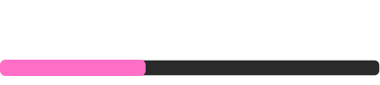
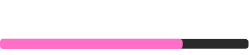

# Hi, I’m Idi 👋  
**DevOps Engineer · UI/UX Tinkerer · Homelab Enthusiast**

I design and automate things — from internal tools and small web apps to always-on game/media servers.  
I like clean UX, reliable infra, and turning scrappy ideas into working systems.

- 🔭 **Current focus:** Hardening homelab services (Plex/CasaOS), automating backups, and shipping a minimal Astro portfolio/blog.  
- 🌱 **Learning:** AWS fundamentals, Python for automation, and Infrastructure as Code (IaC).  
- 🧪 **Recent experiments:** Nightly Minecraft world backups (rclone + cron), one-click server restarts, and lightweight monitoring.  
- 💼 **Portfolio:** [ididev.netlify.app](https://ididev.netlify.app)  
- 🧑‍💻 **All repos:** [github.com/N3onKashimo](https://github.com/N3onKashimo)  
- 📫 **Reach me:** imacoderfromsouthdacoder@gmail.com  

---

## 🔧 What I Build
- **DevOps & Infra:** Containers, simple CI/CD, backups, monitoring, and “set-and-forget” scripts.  
- **Homelab:** Oracle/AWS Free-Tier experiments, Minecraft server automation, and media server setups (Plex/CasaOS).  
- **UI/UX:** Internal site mockups and fast HTML/CSS/JS prototypes for engineering workflows.

---

## 🚀 Highlighted Projects

### 🗂️ Minecraft Server: Nightly Backups & Restore
- rclone → cloud sync, cron scheduling, log rotation, quick restore script.  
- **Tags:** `bash` · `cron` · `rclone` · `oracle-cloud` · `monitoring`

### 🎬 Media Server on CasaOS / Plex
- Automated library scans, hardware-friendly transcode settings, user access control.  
- **Tags:** `docker` · `linux` · `networking`

### 🌐 Portfolio (Astro) + Blog
- Minimal, fast, and easy to extend with `.astro` or Markdown posts.  
- **Tags:** `astro` · `typescript` · `css`

> 💡 Want details or code links? Check my pinned repos.

---

## 🛠️ Tech I Use

**Platforms/Infra:** Docker · Linux · AWS (learning) · Oracle Free Tier  
**DevOps:** CI/CD basics · rclone · cron · shell scripting  
**Langs/Tools:** Bash · Python (learning) · Git · HTML/CSS/TS  
**Design:** Figma · Accessibility-first UI thinking  

  
  
  
  
  
  

---
## 🎓 WGU BSIT Progress

**Overall (includes transfer CUs)**  

**Current Term**  

---

## 📊 LeetCode Profile

---

## 🧩 Fun Stuff
I like automating boring tasks, tweaking UX for internal tools, and hosting games/media so friends don’t have to pay subscriptions.
